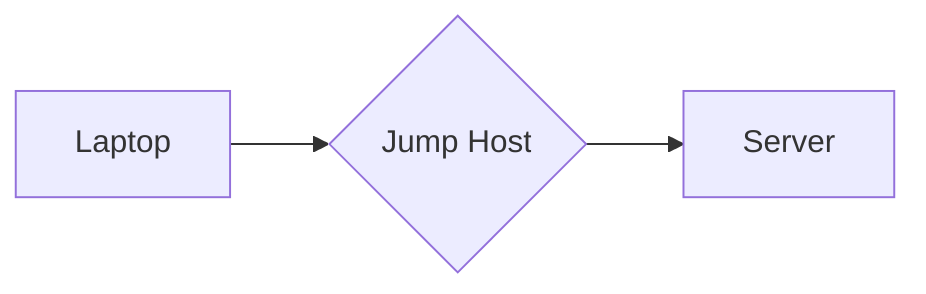

# Roameo

## Overview

If you use OpenSSH a lot, and are on the move a lot, you've probably made use of OpenSSH's `ssh_config(5)` client configuration to have different configurations for different machines or networks. This allows you to have a different configuration for each host you plan to contact, based on the destination name or address.

I wanted to be able to define configurations for hosts based on source address or source network name.

For example, if I'm at home or at the office, and want to ssh into a host, I'm able to establish a direct connection:


But if I'm at home trying to get to work, vice-versa, or anywhere else in the world, I'm likely to need to go through one or more jump hosts, and likely have some SOCKS5 proxy configuration to go along with it:



With this project (Roameo), it's possible to have separate OpenSSH configurations based on either my source IP or subnet, or even the ESSID of the Wireless network I'm attached to currently.

If I'm on my home network, ssh will go direct to my home nodes, or via work's jump hosts for work nodes. If I'm on the office Wi-Fi, ssh will go direct to the office nodes, or via a jump host for home nodes. There is an example configuration fragment below showing this case specifically.

## Implementation

This is a small Rust project that is wrapper around a few ioctls and similar to make it
easier to test for certain platform state quickly and easily. Examples include
being able to test whether we're currently connected to a specific Wi-Fi SSID.

It is intended for use in cases such as `ssh_config(5)`'s `Match exec` clause,
which would allow different OpenSSH client configurations, depending on which
wireless network we're currently connected to. For example, using the
`ProxyJump` configuration option to go through a jump host when on a network
other than the corporate/office network.

This could be done with a few lines of shell script wrapped around command line tools, but I was looking for an excuse to write some Rust code, and going direct with ioctls is less likely to break.

## Compatibility

### SSH Tools

Because this is called from the standard OpenSSH configuration framework, this should be completely transparent to all of the OpenSSH client tools (`ssh`, `sftp`, `scp`, etc).

Not only that, but tools that sit atop OpenSSH, such as Ansible, work seamlessly too. In fact, this is one of the prime drivers behind developing Roameo -- to avoid maintaining sets of inventory variables or command line options for Ansible tools based on where I might be executing from.

### Supported Platforms

Linux is my primary operating system and is the best supported. I do also run and test this code on MacOS, OpenBSD and FreeBSD too, but some of the functionality (ESSID matching for example) are lagging behind a little.

The intent is to support anything Unix-like pretty-well equally.

## Example Configuration

Here's an example `ssh_config(5)` configuration fragment to illustrate how this code might be used:

```
Match host 10.0.0.? !exec "roameo -e CorporateWiFi"
    ProxyJump me@jumphost.corp.net:2222
    ForwardAgent yes
    DynamicForward 3128
```

This hypothetical example:
1. Matches hosts on the 10.0.0.0/24 subnet -- presumably our hypothetical corporate network subnet, and
2. Uses `Match exec` with roameo to match the case where we are *not* on the Wi-Fi network called CorporateWiFi -- presumably our hypothetical corporate network Wi-Fi network ESSID.

Essentially, this gives us specific SSH client configuration for the case where we're trying to access corporate resources, but from a network other than the corporate network.

The example then goes on to set a jump host, agent forwarding and SOCKS5 proxy tunnelling automatically. Whereas when we're on the corporate network, these would not necessarily apply.


# Future Functionality

The initial version only supports matching against an ESSID or a specific source IP address. Functionality planned but not yet implemented includes:

1. Matching against IPv6 addresses and subnets
2. Matching any Wi-Fi connectivity, or any IPv6 (global) addressing
3. Matching VPN and other tunnels
4. Better support for non-Linux platforms
5. Refactor to be more Rusty

Comments and pull requests welcome.

